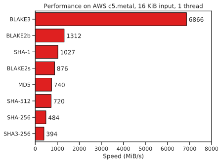

# Bastcoin 0.18.1 ❤️ 🧡 💛 💚 💙 💜 🖤 👀 🌍 👽


URL 🔗 https://bastcoin.org

Mail 📧 // bastcoin@bastcoin.org

## What is Bastcoin?

The bastcoin is a cryptocurrency that has as its main source the bitcoin, but there are several differences between these two cryptocurrencies, including:

-The hash algorithm is not Sha256d but Blake3, I invite you to look below at the README.md of Blake3 or go to the following url: https://github.com/BLAKE3-team/BLAKE3
As you can see in this [picture](20210724_192028[1].jpg) , I did not find any cryptocurrency on Coinmarketcap having blake3 for algorithm.
You can also find [blake3.pdf](blake3.pdf)

-maximum number of coins in circulation is 7,000,000 and not 21,000,000 as bitcoin

-the initial reward per block remains 50 coins, and is therefore halved every 70000 blocks

-difficulty is recalculated every 700 blocks

-and lots of other things I probably forgot ;)

EDIT:Following an error of powlimit in test version, I decided to modify the genesis block and to increase the difficulty and consequently to decrease (to 2.5 minutes) the target duration between 2 consecutive blocks  

## acknowledgements 👏

Thanks to the 6 Github repositories without which the Bastcoin would never have existed:

-https://github.com/bitcoin/bitcoin (the king, Satoshi Nakamoto I love you)

-https://github.com/litecoin-project/litecoin 

-https://github.com/BLAKE3-team/BLAKE3 

-https://github.com/vergecurrency/verge 

Indeed Verge is multi-algorithm, and uses Blake2s (the predecessor of Blake3)

-https://github.com/RavenProject/Ravencoin for the built-in CPU miner, as well as https://github.com/bitcoincloudcore/BitcoinCloud

## License 📝

Bastcoin Core is released under the terms of the MIT license. See [COPYING](COPYING) for more
information or see https://opensource.org/licenses/MIT.

## Get bastcoin

If you want to get Bastcoin Core, you can build it in your operating system.

The releases are now available ;) https://github.com/bastiencaillot/bastcoin/releases/tag/v0.18

-------------------------------------------------

Thank you for reading this far. You will find below the README of Blake3. 

Bastien Caillot, founder of Bastcoin

# The original Blake3 README is located at the following URL: https://github.com/BLAKE3-team/BLAKE3/blob/master/README.md

# <a href="#"></a>

BLAKE3 is a cryptographic hash function that is:

- **Much faster** than MD5, SHA-1, SHA-2, SHA-3, and BLAKE2.
- **Secure**, unlike MD5 and SHA-1. And secure against length extension,
  unlike SHA-2.
- **Highly parallelizable** across any number of threads and SIMD lanes,
  because it's a Merkle tree on the inside.
- Capable of **verified streaming** and **incremental updates**, again
  because it's a Merkle tree.
- A **PRF**, **MAC**, **KDF**, and **XOF**, as well as a regular hash.
- **One algorithm with no variants**, which is fast on x86-64 and also
  on smaller architectures.

The [chart below](https://github.com/BLAKE3-team/BLAKE3-specs/blob/master/benchmarks/bar_chart.py)
is an example benchmark of 16 KiB inputs on modern server hardware (a Cascade
Lake-SP 8275CL processor). For more detailed benchmarks, see the
[BLAKE3 paper](https://github.com/BLAKE3-team/BLAKE3-specs/blob/master/blake3.pdf).

<p align="center">

</p>

BLAKE3 is based on an optimized instance of the established hash
function [BLAKE2](https://blake2.net) and on the [original Bao tree
mode](https://github.com/oconnor663/bao/blob/master/docs/spec_0.9.1.md).
The specifications and design rationale are available in the [BLAKE3
paper](https://github.com/BLAKE3-team/BLAKE3-specs/blob/master/blake3.pdf).
The default output size is 256 bits. The current version of
[Bao](https://github.com/oconnor663/bao) implements verified streaming
with BLAKE3.

This repository is the official implementation of BLAKE3. It includes:

* The [`blake3`](https://crates.io/crates/blake3) Rust crate, which
  includes optimized implementations for SSE2, SSE4.1, AVX2, AVX-512,
  and NEON, with automatic runtime CPU feature detection on x86. The
  `rayon` feature provides multithreading.

* The [`b3sum`](https://crates.io/crates/b3sum) Rust crate, which
  provides a command line interface. It uses multithreading by default,
  making it an order of magnitude faster than e.g. `sha256sum` on
  typical desktop hardware.

* The [C implementation](src/crypto), which like the Rust implementation includes
  SIMD code and runtime CPU feature detection on x86. Unlike the Rust
  implementation, it's not currently multithreaded. See
  [`c/README.md`](src/crypto/README.md).

* The [reference implementation](reference_impl/reference_impl.rs),
  which is discussed in Section 5.1 of the [BLAKE3
  paper](https://github.com/BLAKE3-team/BLAKE3-specs/blob/master/blake3.pdf).
  This implementation is much smaller and simpler than the optimized
  ones above. If you want to see how BLAKE3 works, or you're writing a
  port that doesn't need multithreading or SIMD optimizations, start
  here.

* A [set of test
  vectors](https://github.com/BLAKE3-team/BLAKE3/blob/master/test_vectors/test_vectors.json)
  that covers extended outputs, all three modes, and a variety of input
  lengths.

* [](https://github.com/BLAKE3-team/BLAKE3/actions)

BLAKE3 was designed by:

* [@oconnor663 ](https://github.com/oconnor663) (Jack O'Connor)
* [@sneves](https://github.com/sneves) (Samuel Neves)
* [@veorq](https://github.com/veorq) (Jean-Philippe Aumasson)
* [@zookozcash](https://github.com/zookozcash) (Zooko)

The development of BLAKE3 was sponsored by
[Teserakt](https://teserakt.io) and [Electric Coin Company](https://electriccoin.co).

*NOTE: BLAKE3 is not a password hashing algorithm, because it's
designed to be fast, whereas password hashing should not be fast. If you
hash passwords to store the hashes or if you derive keys from passwords,
we recommend [Argon2](https://github.com/P-H-C/phc-winner-argon2).*

## Usage

### The `b3sum` utility

The `b3sum` command line utility prints the BLAKE3 hashes of files or of
standard input. Prebuilt binaries are available for Linux, Windows, and
macOS (requiring the [unidentified developer
workaround](https://support.apple.com/guide/mac-help/open-a-mac-app-from-an-unidentified-developer-mh40616/mac))
on the [releases page](https://github.com/BLAKE3-team/BLAKE3/releases).
If you've [installed Rust and
Cargo](https://doc.rust-lang.org/cargo/getting-started/installation.html),
you can also build `b3sum` yourself with:

```bash
cargo install b3sum
```

If `rustup` didn't configure your `PATH` for you, you might need to go
looking for the installed binary in e.g. `~/.cargo/bin`. You can test
out how fast BLAKE3 is on your machine by creating a big file and
hashing it, for example:

```bash
# Create a 1 GB file.
head -c 1000000000 /dev/zero > /tmp/bigfile
# Hash it with SHA-256.
time openssl sha256 /tmp/bigfile
# Hash it with BLAKE3.
time b3sum /tmp/bigfile
```

### The `blake3` crate [](https://docs.rs/blake3)

To use BLAKE3 from Rust code, add a dependency on the `blake3` crate to
your `Cargo.toml`. Here's an example of hashing some input bytes:

```rust
// Hash an input all at once.
let hash1 = blake3::hash(b"foobarbaz");

// Hash an input incrementally.
let mut hasher = blake3::Hasher::new();
hasher.update(b"foo");
hasher.update(b"bar");
hasher.update(b"baz");
let hash2 = hasher.finalize();
assert_eq!(hash1, hash2);

// Extended output. OutputReader also implements Read and Seek.
let mut output = [0; 1000];
let mut output_reader = hasher.finalize_xof();
output_reader.fill(&mut output);
assert_eq!(&output[..32], hash1.as_bytes());

// Print a hash as hex.
println!("{}", hash1);
```

Besides `hash`, BLAKE3 provides two other modes, `keyed_hash` and
`derive_key`. The `keyed_hash` mode takes a 256-bit key:

```rust
// MAC an input all at once.
let example_key = [42u8; 32];
let mac1 = blake3::keyed_hash(&example_key, b"example input");

// MAC incrementally.
let mut hasher = blake3::Hasher::new_keyed(&example_key);
hasher.update(b"example input");
let mac2 = hasher.finalize();
assert_eq!(mac1, mac2);
```

The `derive_key` mode takes a context string and some key material (not a
password). The context string should be hardcoded, globally unique, and
application-specific. A good default format for the context string is
`"[application] [commit timestamp] [purpose]"`:

```rust
// Derive a couple of subkeys for different purposes.
const EMAIL_CONTEXT: &str = "BLAKE3 example 2020-01-07 17:10:44 email key";
const API_CONTEXT: &str = "BLAKE3 example 2020-01-07 17:11:21 API key";
let input_key_material = b"usually at least 32 random bytes, not a password";
let email_key = blake3::derive_key(EMAIL_CONTEXT, input_key_material);
let api_key = blake3::derive_key(API_CONTEXT, input_key_material);
assert!(email_key != api_key);
```

### The C implementation

See [`src/crypto/README.md`](src/crypto/README.md).

### Other implementations

We post links to third-party bindings and implementations on the
[@BLAKE3team Twitter account](https://twitter.com/BLAKE3team) whenever
we hear about them. Some highlights include [an optimized Go
implementation](https://github.com/zeebo/blake3), [Wasm bindings for
Node.js and browsers](https://github.com/connor4312/blake3), [binary
wheels for Python](https://github.com/oconnor663/blake3-py), [.NET
bindings](https://github.com/xoofx/Blake3.NET), and [JNI
bindings](https://github.com/sken77/BLAKE3jni).

## Contributing

Please see [CONTRIBUTING.md](CONTRIBUTING.md).

## Intellectual property

The Rust code is copyright Jack O'Connor, 2019-2020. The C code is
copyright Samuel Neves and Jack O'Connor, 2019-2020. The assembly code
is copyright Samuel Neves, 2019-2020.

This work is released into the public domain with CC0 1.0.
Alternatively, it is licensed under the Apache License 2.0.

## Miscellany

- [@veorq](https://github.com/veorq) and
  [@oconnor663](https://github.com/oconnor663) did [a podcast
  interview](https://www.cryptography.fm/3) about designing BLAKE3.
